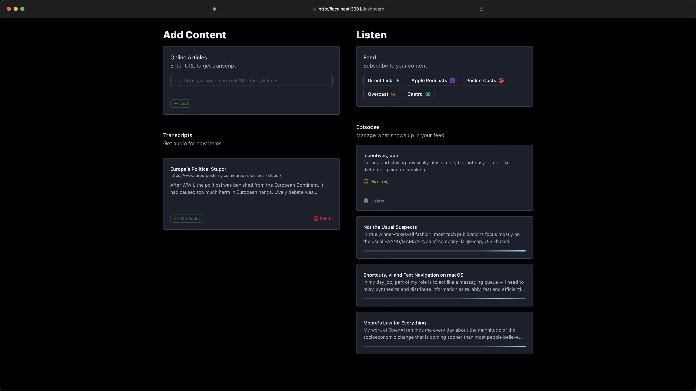

# Chirp

Convert the text content of URLs into a podcast feed, each article becoming an episode read by [OpenAI's TTS API](https://platform.openai.com/docs/guides/text-to-speech).

🚧 Chirp is in early beta state – it works, but expect quite a few rough edges.

## Getting Started

1. You'll need an account and API key for OpenAI: https://platform.openai.com/api-keys. I also recommend to set a monthly budget: https://platform.openai.com/account/limits.

2. You can either run Chirp inside a docker container using the Dockerfile inside the repo (going forward, I plan on publishing some pre-built images too) or directly via `bun run dev` to give it a quick spin.

3. You'll also need a Redis server running, e.g. through their official [Docker image](https://hub.docker.com/_/redis/)

4. To run the docker container after you've built it, you could take this command as starting point, assuming that you run Redis using Docker on the default port (6379): `docker run -d -p 3000:3000 --volume=/replace-with-custom-directory:/data -e "DATA_DIR=/data" -e "REDIS_HOST=host.docker.internal" -e "OPENAI_API_KEY="replace-with-your-openai-api-key" chirp`

5. You can configure the following environment variables (if you run Chirp via `bun run dev`, just create a `.env` file inside the `packages/core` directory and add them there):

   | Name              | Effect                                                                                                                                                                                   |
   | ----------------- | ---------------------------------------------------------------------------------------------------------------------------------------------------------------------------------------- |
   | OPENAI_API_KEY    | Mandatory, authenticates you against OpenAI's TTS API                                                                                                                                    |
   | PASSWORD          | Optional, adds basic authentication using JWTs for your instance. Beware that your feed itself and its data are always public since podcast players don't play well with authentication. |
   | MAX_ARTICLE_CHARS | Optional, this is useful for development if you want to test things and don't want to rack up bills with OpenAI. I use 200 in development.                                               |
   | SSL               | Optional, in case you have Chirp served via HTTPS you will need to set this to true or the feed won't work. Defaults to false.                                                           |
   | PORT              | Optional, defaults to `3000`.                                                                                                                                                            |
   | DATA_DIR          | Optional, defaults to the directory Chirp is being executed from.                                                                                                                        |
   | REDIS_HOST        | Optional, defaults to `localhost`. If not specified, a Redis instance will be spin up.                                                                                                   |
   | REDIS_PORT        | Optional, defaults to `6379`.                                                                                                                                                            |

## Developer Guide

- You will need the Bun runtime: https://bun.sh
- Chirp is organized as a monorepo, with a web client using React with Vite and the core (backend) using Bun. There's a shared package to share types and utility functions between the two.
- In case you've never spun up Redis before, but pulled the Docker image already, you can run `bun run redis` inside the main directory.
- To spin up both the Vite development server and the Bun backend, just run `bun run dev` inside the main directory.

## Acknowledgements

Chirp depends on a ton of open source projects. Here's an (incomprehensive) list of them:

- OpenAI TTS API: I've tried other TTS APIs, but this one has the best quality so far in my view.
- Bun: hyped for a reason, it really is that fast, well documented and convenient to use
- Elysia: effortless APIs with Bun
- Chakra UI: It's ridiculously simple to hack together a decent looking web app with it
- Phosphor Icons: some of the most beautiful and versatile icons around
- Readability: extracts the text content of an URL, this is what Firefox uses for its reader view and the folks at the Mozilla foundation were kind enough to pack it into a Node lib, too
- FFMPEG: https://www.youtube.com/watch?v=9kaIXkImCAM
